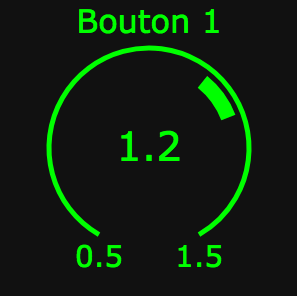
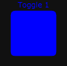
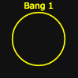
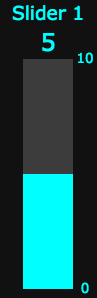
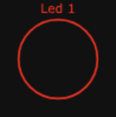
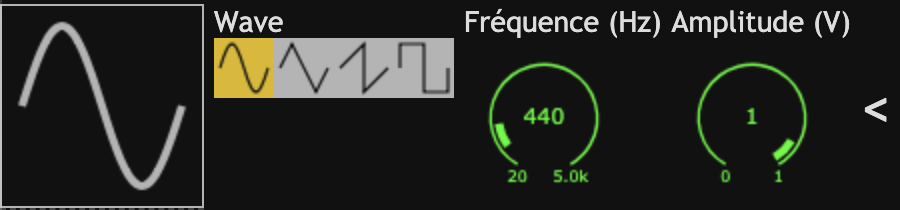
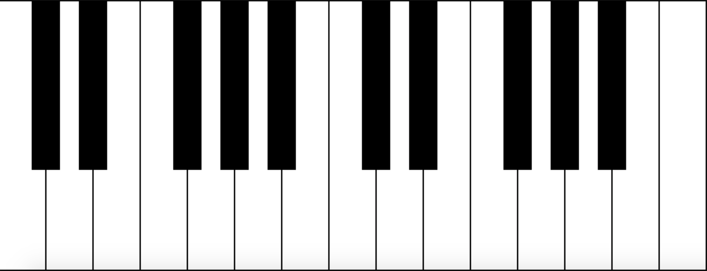

# objectsKontrol
Bibliothèque d'interfaces simples réalisées en HTML.

Objets disponibles : 

* Knob
* Toggle
* Bang
* Slider
* Led
* Oscillator (oscillateur)
* Out (sortie audio)
* Piano

Les valeurs de ces objets sont envoyées avec le protocole OSC (Open Sound Control) via une websocket à une adresse IP et un numéro de port paramétrable. 

Toutes les balises objetsKontrol doivent être contenu dans une div dont l'id doit être **"container"**.

Pour que l'interface fonctionne, il faut un Web Socket serveur qui écoute.

L'adresse IP du Web Socket serveur est paramétrable avec l'attribut paramétrable **data-web-socket-server** et le numéro de port avec l'attribut paramétrable **data-web-socket-server**. 

Ce qui nous donne par exemple :
 
	

	...
	

## Attributs des objets d'interface

Chaque objet d'interface est paramétrable à l'aide d'attributs de la balise div. Tous ces attributs paramétrables commencent par data-.  

### Knob

* **class** : knob
* **data-legende** : titre de l'objet. Si vous n'en souhaitez pas ne mettez pas cet attribut. Exemple "Bouton 1".
* **data-width** : en pixels
* la hauteur est égale à la largeur 
* **data-style-border** : pour définir éventuellement le style de la bordure de l'objet
* **data-couleur** : couleur de l'objet. Syntaxe R,V,B. Exemple "0,255,0".
* **data-angle-depart** : angle qui détermine le point de départ du bouton. L'angle est défini par rapport à la verticale en partant d'en bas. Valeur possible de 0 à 360. Exemple "30".
* **data-angle-arrivee** : angle qui détermine le point d'arrivée du bouton. Valeur possible de 0 à 360. Exemple "330". 
* **data-valeur-min** : valeur minimum du bouton. Exemple "0.5"
* **data-valeur-max** : valeur maximum du bouton. Exemple "1.5"
* **data-valeur-init** : valeur initale du bouton. Doit se situer entre valeur-min et valeur-max. Exemple "1.2"
* **data-adresse-OSC** : adresse OSC de destination des valeurs du bouton. Dès que la valeur du bouton change, un message OSC est envoyé avec la nouvelle valeur du bouton. Exemple "/1/gain".
* **data-type-val** : Type de la donnée du bouton. f = float et i = integer. Exemple "f". 
 
### Toggle

* **class** : toggle
* **data-legende** : titre de l'objet. Si vous n'en souhaitez pas ne mettez pas cet attribut. Exemple "Toggle 1".
* **data-width** : en pixels
* la hauteur est égale à la largeur
* **data-style-border** : pour définir éventuellement le style de la bordure de l'objet
* **data-couleur** : couleur de l'objet. Syntaxe R,V,B. Exemple "0,0,255".
* **data-etat-init** : valeur initale du toggle. 0 il est éteint. 1 il est allumé. Exemple "1". 
* **data-adresse-OSC** : adresse OSC de destination de l'état du toggle. Dès que l'état du toggle change, un message OSC est envoyé avec le nouvel état du toggle. Exemple "/1/effet1". 

### Bang

* **class** : bang
* **data-legende** : titre de l'objet. Si vous n'en souhaitez pas ne mettez pas cet attribut. Exemple "Bang 1".
* **data-width** : en pixels
* la hauteur est égale à la largeur
* **data-style-border** : pour définir éventuellement le style de la bordure de l'objet
* **data-couleur** : couleur de l'objet. Syntaxe R,V,B. Exemple "255,255,0".
* **data-adresse-OSC** : adresse OSC de destination de l'état du bang. Dès qu'on appuie sur le bang, un message OSC est envoyé. Exemple "/bang"

### Slider

* **class** : slider
* **data-legende** : titre de l'objet. Si vous n'en souhaitez pas ne mettez pas cet attribut. Exemple "Slider 1".
* **data-width** : en pixels
* **data-height** : en pixels. Attention la hauteur doit être le triple de la largeur.
* **data-style-border** : pour définir éventuellement le style de la bordure de l'objet
* **data-couleur** : couleur de l'objet. Syntaxe R,V,B. Exemple "0,255,255".
* **data-valeur-min** : valeur minimum de la glissière. Exemple "0"
* **data-valeur-max** : valeur maximum de la glissière. Exemple "10"
* **data-valeur-init** : valeur initale de la glissière. Doit se situer entre valeur-min et valeur-max. Exemple "5"
* **data-adresse-OSC** : adresse OSC de destination des valeurs de la glissière. Dès que la valeur de la glissière change, un message OSC est envoyé avec la nouvelle valeur de la glissière. Exemple : "/3/gain". 
* **data-type-val** : Type de la donnée de la glissière. f = float et i = integer. Exemple "f".

### Led

* **class** : slider
* **data-legende** : titre de l'objet. Si vous n'en souhaitez pas ne mettez pas cet attribut. Exemple "Led 1".
* **data-width** : en pixels
* la hauteur est égale à la largeur
* **data-style-border** : pour définir éventuellement le style de la bordure de l'objet
* **data-couleur** : couleur de l'objet. Syntaxe R,V,B. Exemple "255,0,0".
* **data-adresse-OSC** : adresse OSC de destination des valeurs de la glissière. Dès que la valeur de la glissière change, un message OSC est envoyé avec la nouvelle valeur de la glissière. Exemple : "/led1". 

### Oscillator

* **class** : oscillator
* **data-type** : type du signal à synthétiser. Valeurs possibles : sine, triangle, sawtooth, square. 
* **data-valeur-min-freq** : valeur minimum de la fréquence du signal à synthétiser
* **data-valeur-max-freq** : valeur maximum de la fréquence du signal à synthétiser
* **data-frequency** : fréquence initiale du signal à synthétiser
* **data-valeur-min-ampl** : valeur minimum de l'amplitude crête du signal à synthétiser
* **data-valeur-max-ampl** : valeur maximum de l'amplitude crête du signal à synthétiser
* **data-amplitude** : amplitude crête initiale du signal à synthétiser
* **data-adresse-OSC** : adresse OSC de destination des paramètres de l'oscillateur. Dès qu'un des paramètres de l'oscillateur change (type, fréquence ou amplitude crête), un message OSC est envoyé avec la nouvelle valeur du paramètre. Exemple : "/osc1". 
* **data-type-val** : Type de la donnée pour la fréquence et l'amplitude crête de l'oscillateur. f = float et i = integer. Exemple "f".

### Out

* **class** : out
* **data-width** : en pixels
* **data-height** : en pixels
* **data-style-border** : pour définir éventuellement le style de la bordure de l'objet
* **data-adresse-OSC** : adresse OSC de destination de l'état de la sortie audio. Dès que l'état de la sortie audio change, un message OSC est envoyé avec le nouvel état. Exemple : "/out". 
* **data-type-val** : Type de la donnée de la sortie audio. f = float et i = integer. Exemple "i".

### Piano

* **class** : piano
* **data-width** : en pixels
* **data-style-border** : pour définir éventuellement le style de la bordure de l'objet
* **data-legende** : true ou false, pour définir l'affichage du nom des notes
* **data-adresse-OSC** : adresse OSC de destination de l'état des touches appuyées et relachées. Exemple : "/piano". 
* **data-type-couleur** : couleur des touches appuyées. Exemple : "rgba(222,184,0,0.5)".

