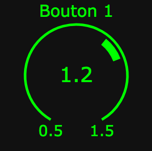
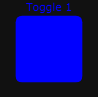
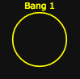
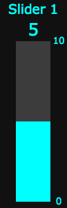

# canvas-Kontrol
Bibliothèque d'interfaces simples réalisées en canvas.

Objets disponibles : 

* Knob
* Toggle
* Bang
* Slider

Les valeurs de ces objets sont envoyées avec le protocole OSC (Open Sound Control) via une websocket à une adresse IP paramétrable (cf. fichier osc.js).

Pour que l'interface fonctionne, il faut un Web Socket serveur qui écoute.

##Attributs des objets d'interface

Chaque objet d'interface est paramétrable à l'aide d'attributs de la balise canvas. Tous ces attributs paramétrables commencent par data-.  

###Knob

* **width** : en pixels
* **height** : en pixels. Attention la hauteur doit être égale à la largeur. 
* **data-legende** : titre de l'objet. Si vous n'en souhaitez pas ne mettez pas cet attribut. Exemple "Bouton 1".
* **data-couleur** : couleur de l'objet. Syntaxe R,V,B. Exemple "0,255,0".
* **data-angle-depart** : angle qui détermine le point de départ du bouton. Valeur possible de 0 à 360. Exemple "30".
* **data-angle-arrivee** : angle qui détermine le point d'arrivée du bouton. Valeur possible de 0 à 360. Exemple "330". 
* **data-valeur-min** : valeur minimum du bouton. Exemple "0.5"
* **data-valeur-max** : valeur maximum du bouton. Exemple "1.5"
* **data-valeur-init** : valeur initale du bouton. Doit se situer entre valeur-min et valeur-max. Exemple "1.2"
* **data-adresse-OSC** : adresse OSC de destination des valeurs du bouton. Dès que la valeur du bouton change, un message OSC est envoyé avec la nouvelle valeur du bouton. Exemple "/1/gain".
* **data-type-val** : Type de la donnée du bouton. f = float et i = integer. Exemple "f". 
 
 ###Toggle

* **width** : en pixels
* **height** : en pixels. Attention la hauteur doit être égale à la largeur. 
* **data-legende** : titre de l'objet. Si vous n'en souhaitez pas ne mettez pas cet attribut. Exemple "Toggle 1".
* **data-couleur** : couleur de l'objet. Syntaxe R,V,B. Exemple "0,0,255".
* **data-etat-init** : valeur initale du toggle. 0 il est éteint. 1 il est allumé. Exemple "1". 
* **data-adresse-OSC** : adresse OSC de destination de l'état du toggle. Dès que l'état du toggle change, un message OSC est envoyé avec le nouvel état du toggle. Exemple "/1/effet1". 

 ###Toggle

* **width** : en pixels
* **height** : en pixels. Attention la hauteur doit être égale à la largeur. 
* **data-legende** : titre de l'objet. Si vous n'en souhaitez pas ne mettez pas cet attribut. Exemple "Bang 1".
* **data-couleur** : couleur de l'objet. Syntaxe R,V,B. Exemple "255,255,0".
* **data-adresse-OSC** : adresse OSC de destination de l'état du bang. Dès qu'on appuie sur le bang, un message OSC est envoyé. Exemple "/bang"

 ###Slider

* **width** : en pixels
* **height** : en pixels. Attention la hauteur doit être le triple de la largeur. 
* **data-legende** : titre de l'objet. Si vous n'en souhaitez pas ne mettez pas cet attribut. Exemple "Slider 1".
* **data-couleur** : couleur de l'objet. Syntaxe R,V,B. Exemple "0,255,255".
* **data-valeur-min** : valeur minimum de la glissière. Exemple "0"
* **data-valeur-max** : valeur maximum de la glissière. Exemple "10"
* **data-valeur-init** : valeur initale de la glissière. Doit se situer entre valeur-min et valeur-max. Exemple "5"
* **data-adresse-OSC** : adresse OSC de destination des valeurs de la glissière. Dès que la valeur de la glissière change, un message OSC est envoyé avec la nouvelle valeur de la glissière. Exemple : "/3/gain". 
* **data-type-val** : Type de la donnée de la glissière. f = float et i = integer. Exemple "f". 

